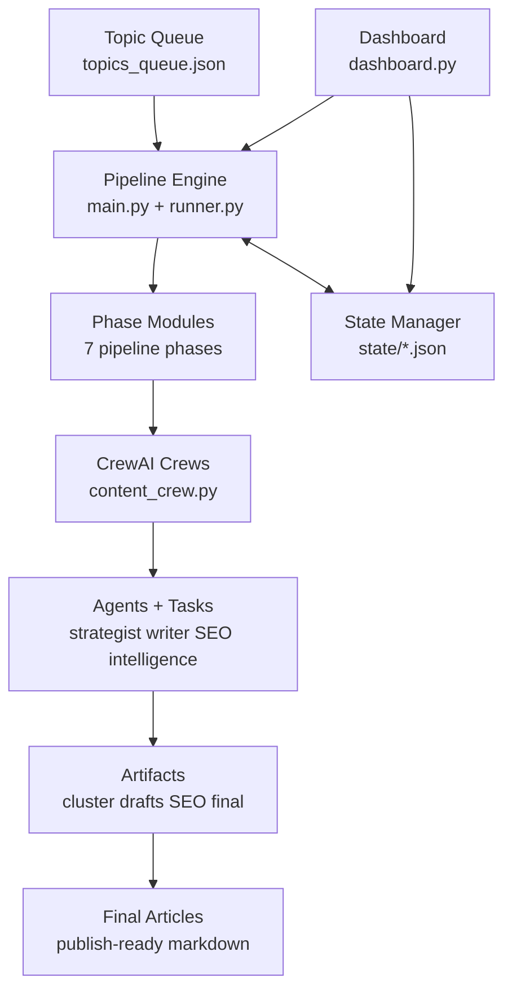

# AI Content Engine Architecture

## Quick Visual

### Simple Flow

```text
topics_queue.json
  ↓
main.py / pipeline runner
  ↓
engine/pipeline/phases/*
  ↓
crews/content_crew.py
  ↓
CrewAI Agents + Tasks
  ↓
outputs/*.md, *_seo.md, *_final.md, *_cluster.json
  ↓
SEO + Link Injection + Humanization + Publish-ready Articles
```

### Slightly Expanded View

```text
      dashboard.py (temporary UI)
          │
          │ triggers / monitors
          ▼
topics_queue.json → Pipeline Engine → Phase Modules → CrewAI Crews → Artifacts
    │                │                 │               │              │
    │                │                 │               │              └─ final articles
    │                │                 │               └─ agents + tasks
    │                │                 └─ 7 execution phases
    │                └─ run control + summaries
    └─ topic input

          Pipeline Engine ↔ tools/state_manager.py ↔ state/*.json
                   │
                   └─ progress, approvals, resume/retry
```

### Mermaid Diagram



## Purpose
This document defines the current architecture, target repository layout, and execution/data flow for long-term development.

The current dashboard is a temporary operations surface and does not define the engine architecture.

---

## Current System Snapshot

### Engine Modules
- `main.py` is the current pipeline runner and phase coordinator.
- `crews/content_crew.py` composes CrewAI crews for strategy, writing, SEO, and intelligence.
- `tasks/` contains task templates that encode task contracts (inputs/expected outputs).

### Agents
- `agents/strategist.py`: pillar/spoke cluster strategy.
- `agents/writer.py`: outline + article generation.
- `agents/seo_agents.py`: SEO optimization + internal linking suggestions.
- `agents/intelligence_agents.py`: competitor crawling + content gap detection.

### Tools
- `tools/state_manager.py`: workflow state persistence by topic.
- `tools/link_injector.py`: resolves placeholder links into concrete article filenames.
- `tools/article_post_processor.py`: post-processing transformations applied to generated articles.
- `tools/search_tools.py`: crawling/scraping tool access.
- `tools/wordpress_tool.py`: optional publishing integration.

### Pipeline Orchestration
Current execution in `engine/pipeline/runner.py` is phase-based and queue-driven (11 phases in execution order):
1. Cluster Map Generation
2. Cluster Strategy
3. SERP Analysis
4. Pillar Generation
5. Spoke Generation
6. SEO Optimization
7. Intelligence Gap Detection
8. Cluster Scaling
9. Final Link Injection
10. Humanization & Readability
11. Article Quality Assurance

`main.py` is a thin CLI entrypoint delegating to `engine.pipeline.flow_spike.run_pipeline_entry`, which calls `runner.run_pipeline`.

### State Handling
- State is JSON-file based under `state/`.
- Per-topic files (`state/workflow_<topic>.json`) hold progress flags and counters.
- Queue source is `topics_queue.json`.

### Outputs
- Cluster blueprints: `outputs/*_cluster.json`
- Draft and transformed content: `outputs/*.md`, `*_seo.md`, `*_final.md`

### Frontend / Dashboard
- `dashboard.py` (Streamlit) is currently a temporary operations console.
- It starts pipeline runs, shows status/progress, manages queue entries, and previews artifacts.
- It should stay thin and call engine interfaces instead of owning business rules.

---

## Canonical Pipeline (Must Preserve)

The canonical 11-phase pipeline (matches `engine/pipeline/runner.py` execution order):
1. Cluster Map Generation
2. Cluster Strategy
3. SERP Analysis
4. Pillar Article Generation
5. Spoke Article Generation
6. SEO Optimization
7. Intelligence Gap Detection
8. Cluster Scaling
9. Final Link Injection
10. Humanization & Readability
11. Article Quality Assurance

Notes:
- Phases 4 and 5 may execute in one production stage internally, but must remain separately tracked.
- Phase 8 uses intelligence outputs to add/refine spokes and schedule incremental production runs.
- All phase IDs must remain stable — they are referenced by state keys and run summaries.

---

## Target Repository Structure

```text
ai-content-engine/
  engine/
    __init__.py
    pipeline/
      runner.py                # Phase scheduler + execution graph
      phases/
        cluster_map_generation.py
        cluster_strategy.py
        serp_analysis.py
        pillar_generation.py
        spoke_generation.py
        seo_optimization.py
        intelligence_gap_detection.py
        cluster_scaling.py
        final_link_injection.py
        humanization_readability.py
        article_quality_assurance.py
    models/
      topic.py                 # Topic/work item models
      cluster.py               # Cluster/spoke contracts
      workflow_state.py        # Typed state schema
    services/
      queue_service.py
      state_service.py
      artifact_service.py

  agents/
    strategist.py
    writer.py
    seo_agents.py
    intelligence_agents.py
    registry.py                # Agent factory/registration layer

  tasks/
    strategist_tasks.py
    writer_tasks.py
    seo_tasks.py
    intelligence_tasks.py

  crews/
    content_crew.py            # Transitional adapter; eventually optional

  tools/
    state_manager.py
    link_injector.py
    article_post_processor.py
    search_tools.py
    wordpress_tool.py

  state/
    workflow_state.json
    workflow_<topic>.json

  outputs/
    *.json
    *.md

  frontend/
    streamlit/
      app.py                   # Temporary monitor/control UI

  scripts/
    run_pipeline.py
    migrate_state.py
    backfill_artifacts.py

  docs/
    ARCHITECTURE.md
    ROADMAP.md
    DEV_RULES.md

  CHANGELOG.md
  requirements.txt
  main.py                      # Transitional entrypoint; delegates to engine
```

---

## Responsibility Boundaries

### Engine (`engine/`)
- Owns phase ordering, retry policy, state transitions, validation, and resumability.
- No Streamlit/UI logic.

### Agents + Tasks (`agents/`, `tasks/`)
- Define LLM behavior and expected outputs.
- Must remain stateless and reusable across interfaces (CLI/UI/API).

### Tools (`tools/`)
- Deterministic side-effect modules (scraping, link rewriting, publishing).
- Should expose clear contracts and input validation.

### Frontend (`frontend/`)
- Reads queue/state/outputs via engine services.
- Triggers pipeline actions through stable interfaces; no file-shape assumptions.

---

## Data Flow

1. Queue item loaded (`topic`, optional metadata, priority).
2. Pipeline runner resolves latest state snapshot.
3. Each phase executes if prerequisite flags are satisfied.
4. Artifacts are written to `outputs/`.
5. State transitions are persisted atomically per phase.
6. Intelligence findings create/upsert additional spokes (scaling inputs).
7. Final link injection produces publish-ready `*_final.md` artifacts.

---

## Stability and Scaling Recommendations

1. Introduce a typed state schema and version field (`state_version`) for migration safety.
2. Move phase logic out of `main.py` into `engine/pipeline/phases/*` modules.
3. Add a phase registry (plugin pattern) so new phases can be added without editing runner core.
4. Make each phase idempotent (safe to re-run without data corruption).
5. Separate artifact tiers explicitly: `draft -> seo -> final`.
6. Keep UI as a client of engine APIs/services, not an orchestration owner.
